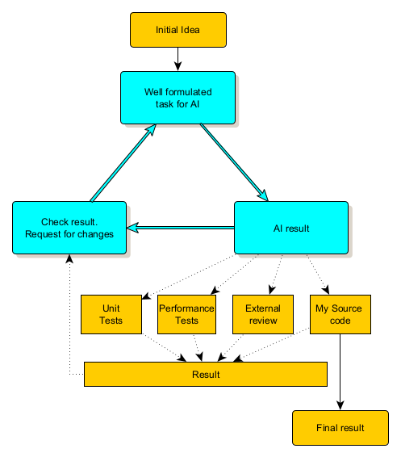

# Artificial Intelligence for Programmers
[DE version](readme-de.md)

## Overview

The question of whether we need artificial intelligence (AI) right now is a topic of much debate. Some argue that life without AI would be unimaginable, while others dismiss it as unnecessary or overhyped. As with many debates, the truth likely lies somewhere in between.

AI is increasingly becoming an essential part of modern software development. From automating routine tasks to assisting with complex problem-solving, it can significantly enhance productivity and efficiency. However, it's important to recognize that AI is not a one-size-fits-all solution. Developers must understand both its potential and its limitations to use it effectively.

## The Role of AI in Software Development

Understanding AI’s impact requires exploring the models behind AI systems and the platforms that bring them to life.

### AI Language Models

AI language models like GPT-4, Gemini, and Claude are advanced systems capable of processing and generating human-like text by learning from extensive datasets. These models utilize neural networks to recognize language patterns, enabling them to predict subsequent words or phrases.

By adjusting millions of parameters, these models automate tasks such as writing, code generation, and debugging. They enhance software development processes by creating documentation, providing code suggestions, and simulating human-like conversations. For more details, see the [list of models](models.md).

### Applications and Websites

AI applications leverage these language models to create user-friendly tools for specific tasks. When integrated into real-world platforms, AI delivers features like virtual assistants, intelligent code suggestions, and personalized user experiences. This integration allows developers to streamline tasks and improve productivity. For more information, check the [list of tools](tools.md).

## Viewing AI as a Helper, Not a Replacement

The perspective of artificial intelligence (AI) as a supportive tool rather than a complete solution aligns closely with its current applications in software development. 

Despite the capabilities of AI in generating code or providing solutions, the responsibility for reviewing, refining, and integrating AI's output ultimately lies with the developer. The AI's contribution should be viewed as a starting point or suggestion, necessitating human oversight to ensure that the final product meets quality and contextual standards.

### AI Tools in Programming

The application of AI in software development is wide-ranging:

- **Code Generation**: Tools assist in generating code snippets and completing code based on partial inputs. We will focus on this part.
- **Bug Detection**: AI-powered tools help identify vulnerabilities or performance issues in real-time.
- **Testing and Quality Assurance**: AI platforms automate testing, reducing human error and ensuring better code coverage.
- **Project Management**: AI-driven solutions provide project insights, optimize workflows, and automate mundane tasks.
- **Documentation**: Assisting in the creation and maintenance of project documentation.

### Key Benefits of AI in Development

The primary benefits of AI in software development center around **enhancing productivity** and efficiency. Key advantages include:

1. **Faster Development**: AI tools enable developers to work more quickly and efficiently.
2. **Higher Quality Code**: By identifying potential issues early, AI contributes to producing more reliable software.
3. **Streamlined Workflows**: Automation of routine tasks allows developers to allocate more time to creative problem-solving.
4. **Efficient Testing**: AI generates and runs test cases more comprehensively than manual efforts.
5. **Better Collaboration**: Teams can work more cohesively with AI-enhanced documentation and communication tools.

It is essential to recognize that AI is not a replacement for human expertise and decision-making; rather, it serves to enhance these elements. AI allows developers to focus on more complex and creative aspects of their work.
AI are designed to **assist** developers rather than replace them.

### Key Points to Consider
- The current state of AI aligns with the view of AI as a helper, enhancing human capabilities rather than replacing them.
- AI tools are primarily designed to streamline workflows and augment human skills, not to produce finished products in isolation.
- Human oversight is crucial in evaluating, refining, and implementing AI-generated outputs.
- Successful integration of AI across various fields relies on a collaborative approach where AI augments human skills and expertise.

While the sources discussed primarily focus on specific applications of AI in software development, they support the notion of AI as a helper. Broader philosophical discussions about AI's future potential, including the possibility of creating fully autonomous systems, remain outside the scope of this analysis. 

## Understanding AI's Dual Nature
Working with AI is not as easy as you might think. An analogy can be drawn by comparing AI to both a tool and an animal. You need to know how to use the tool and you need to know the animal's habits to know what to expect from it.

  
*Image generated using AI (DALL-E)*  

### AI as a Tool

1. **Designed for Specific Functions**: Just like any tool, AI is created with specific tasks in mind. Models like GPT-4 excel at text and code generation, while others, like DALL-E, specialize in image creation. Each AI model is highly efficient in its domain but not versatile across all tasks.  Like any tool, AI requires an understanding of its operation and limitations.  

   
2. **Requires User Expertise**: Just as a carpenter must know how to use a hammer properly, a developer must understand how to interact with AI tools. Effective use depends on knowing both the AI's strengths and its limitations. For example, AI is great for generating boilerplate code but may struggle with complex context or nuanced changes.

### AI as an Animal

1. **Unpredictable Behavior**: Like an animal, AI can behave unpredictably. For example, when tasked with refining code, AI might lose context and deliver inconsistent results. It's important to frame your requests carefully to ensure AI maintains the context and doesn't shift focus. Another challenge arises when switching between different versions of the code—original and updated. After the first iteration, the new code may be fine but could lack parts of the old version. If you ask the AI to restore the missing portions, it might revert to the original code entirely.

   Another issue is the output format: AI might generate a complete class or a mixture of new and unchanged functions, sometimes even adding comments referencing old versions. This can complicate the process of updating your code. To manage this effectively, consider using version control tools like Git or creating separate versions of your files.

2. **"Black Box" Nature**: While developers can analyze AI's output, understanding how the AI arrived at that output can be as mysterious as animal instincts. This is due to the opaque nature of machine learning algorithms and the vast amounts of data they process, making their decision-making process difficult to fully comprehend.

### Balancing Both Perspectives

Using AI effectively requires combining the control of a tool with the patience of working with an unpredictable animal. Developers need to both guide and adapt to the AI's strengths while being ready to intervene when things go off track.

## A Practical Workflow for Using AI in Development

While AI can assist in development, it won’t solve every problem flawlessly. Some tasks are straightforward, but others may require patience and persistence. It is important to know the problem you are trying to solve, otherwise the AI may suggest the wrong way to solve it.

Here's a structured, iterative approach to using AI effectively:

### 1. **Define the Task Clearly**
   - **Document the Task**: Start by outlining the task requirements in detail. The clearer the input, the better the AI's output will be.
   - **Task Decomposition:**  Breaking down complex coding tasks into smaller, manageable steps appears to be a key strategy in your approach.

   - **Initial Test with Basic AI**: Use a simpler AI model for a preliminary check to refine your task description.
   - **Upgrade to Advanced AI**: Switch to a more powerful model, like GPT-4 or Claude, for deeper, more refined results after initial testing.

### 2. **Receive and Inspect the Solution**
   - **Generated Code**: Review the code or solution provided by the AI directly in the output window.

### 3. **Review, Test, and Refine**
   - **Manual Review**: Copy code into your IDE and inspect the AI-generated code for correctness, logic, and efficiency.
   - **Compile and Test**: Ensure the code compiles without errors, and run tests to verify functionality.
   - **Unit Tests**: Ask the AI to generate unit tests. Then run and correct it together. Expect some adjustments, as the initial results might not be perfect.
   - **Performance Testing**: Request AI-driven performance optimizations, but monitor for any unexpected slowdowns. AI could also create performance tests.
   - **Cross-Check with Another AI**: Get a second AI model to review the code for further insights or improvements.Ask the AI to explain the code as well, and compare it with the original task.

### 4. **Iterate and Refine**
   - **Code Improvements**: Continuously ask the AI for optimizations, following principles such as DRY (Don't Repeat Yourself) and SOLID, to ensure clean, maintainable code. But don't start optimizing too early.
   - **Re-run Tests**: Keep testing and refining until the code behaves as expected.

### 5. **Know When to Stop**
   - **Avoid Over-Tweaking**: Excessive reliance on AI or endless tweaking may reduce productivity.
   - **Avoid long repetitive action**: If you're stuck in a repetitive cycle of getting incorrect results, it's time to step back and reassess.
   
This structured approach ensures AI can assist in speeding up the development process, but ultimately, the responsibility for code quality remains with the developer.

## Limitations and Challenges of AI

Despite its advantages, AI comes with a range of limitations:

- **Contextual Understanding**: AI models often struggle to fully grasp complex or evolving contexts, leading to inconsistent or inaccurate outputs. Never ask for more than one change at a time.
- **Data Bias**: AI performance is heavily influenced by the data it's trained on. If that data contains biases or gaps, the model will reflect those flaws in its results.
- **Limited Creativity**: While AI excels at pattern recognition, it falls short in true innovation and out-of-the-box problem-solving, which remain primarily human strengths.
- **Ethical and Privacy Concerns**: The opaque nature of AI decision-making raises significant concerns about accountability and privacy.

Additionally, AI platforms, especially in free versions, have certain restrictions:

- **Input and Output Limits**: There are constraints on the size of input text and overall conversation length.
- **Request Limitations**: The number of consecutive requests may also be limited.

These limitations may vary depending on the platform and whether it’s a free or paid version, with paid versions generally offering fewer restrictions.

## How to Get Started with AI Tools

**Try Before You Buy**: Start with the free version of the tool you're interested in, and then decide which paid option suits your needs.

1. **Using Copilot on Windows**:
   - Open the Edge browser and launch Microsoft Copilot (not to be confused with GitHub Copilot it is not free for all). 
    
   - You can also install it as an [application](https://www.microsoft.com/en-us/microsoft-copilot/personal-ai-assistant).
   - Accessing Copilot in Skype: You can also utilize Copilot in Skype.

2. **Explore free plan of AI Platforms**:
   - [Blackbox AI](https://www.blackbox.ai/)
   - [ChatGPT AI](https://chatgpt.com/) or explore [different implementations](https://chatgpt.com/gpts) to find the best fit.
   - [Claude AI](https://claude.ai)
   - [Gemini AI](https://gemini.google.com/app)
   - [Perplexity AI](https://www.perplexity.ai/)

3. **Integrate AI plugins into your IDE** (as an example):
   - For Visual Studio Code: [BlackBox AI](https://marketplace.visualstudio.com/items?itemName=Blackboxapp.blackbox)
   - For Visual Studio: [Tabnine](https://marketplace.visualstudio.com/items?itemName=TabNine.tabnine-visual-studio) - excellent for creating or updating unit tests.
   - For Rider: A free version of Gemini is available until 8.11.2024.

## Helpful links

For more information about the tools available, see the [List of Tools](tools.md).

### Articles

- [What are AI Models?](https://www.hpe.com/emea_europe/en/what-is/ai-models.html) - HPE's glossary entry explaining AI models and their operation.
- [AI Models: How Does It Work? Explained](https://www.koombea.com/blog/ai-models/) - Koombea's blog post detailing different types of AI models and their functionalities.
- [The Guide to Understanding and Using AI Models (2024)](https://viso.ai/deep-learning/ml-ai-models/) - Viso.ai's comprehensive guide on AI models and their applications in business.
- [AI in Software Development: Top Tools and Use Cases](https://decode.agency/article/ai-software-development-tools/) - Decode's article on AI tools and their applications in software development.
- [11 Generative AI Use Cases in Software Development](https://www.index.dev/blog/11-generative-ai-use-cases-software-development) - Index.dev's blog post on various applications of generative AI in software development.
- [AI in Software Development: Use Cases and Tools](https://www.alexanderthamm.com/en/blog/ai-in-software-development/) - Alexander Thamm's overview of AI applications and tools in software development.
- [8 Ways to Use AI in Software Development](https://www.zartis.com/8-ways-to-use-ai-in-software-development/) - Zartis's guide on integrating AI into software development processes.
- [Exploring the Nine Best AI Code Generation Tools](https://pieces.app/blog/9-best-ai-code-generation-tools) - An evaluation of the best AI code generation tools based on accuracy, ease of use, features, pricing, and speed of the generative capabilities.
- [Top 10 AI Tools for Developers](https://pieces.app/blog/top-10-ai-tools-for-developers) - Pieces.app's list of recommended AI tools for developers.

### Videos
- [How AI works](https://www.youtube.com/watch?v=1aM1KYvl4Dw) - An overview of artificial intelligence fundamentals and how AI systems function.
- [How LLM works](https://www.youtube.com/watch?v=osKyvYJ3PRM) - An explanation of Large Language Models (LLMs) and their underlying mechanisms.
- [Transformers, how LLM works](https://www.youtube.com/watch?v=wjZofJX0v4M) - A deep dive into transformer architecture, the backbone of modern LLMs.
- [Introduction to Generative AI](https://www.youtube.com/watch?v=cZaNf2rA30k) - An introductory guide to generative AI and its applications.
- [Linus Torvalds: Speaks on Hype and the Future of AI](https://www.youtube.com/watch?v=7GIZi7nlIe0) - Linux creator Linus Torvalds shares his perspective on AI's current state and future potential.
- [How generative AI is transforming the software development lifecycle](https://www.youtube.com/watch?v=bzwtGU-0ObY)
- [AI for software development: A reality check](https://www.youtube.com/watch?v=pajcn6ApyD8)

## Conclusion

To use, or not to use AI, that is the question. It is up to you to decide, but it never hurts to try.

Developers must harness AI's power to automate and optimize, while remaining aware of its unpredictability and limitations. By integrating AI thoughtfully into the development process-combining human expertise with AI's efficiency programmers can enhance their productivity while maintaining control over the final product. 

As AI continues to evolve, so too will the best practices for using it effectively in software development.

## Author

Alex Nek