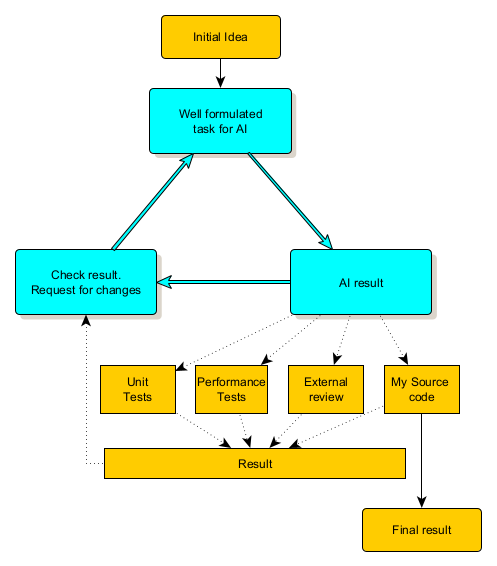

# Künstliche Intelligenz für Programmierer

## Überblick

Die Frage, ob wir Künstliche Intelligenz (KI) heute brauchen, wird viel diskutiert. Die einen argumentieren, dass ein Leben ohne KI undenkbar wäre, während die anderen die KI für einen unnötigen oder übertriebenen Hype halten. Wie bei vielen Debatten liegt die Wahrheit wahrscheinlich irgendwo dazwischen.

KI wird zunehmend zu einem wesentlichen Bestandteil der modernen Softwareentwicklung. Von der Automatisierung alltäglicher Aufgaben bis hin zur Unterstützung bei der Lösung komplexer Probleme kann sie die Produktivität und Effizienz signifikant erhöhen. Es ist jedoch wichtig zu erkennen, dass KI keine Universallösung ist. Es ist wichtig, dass die Entwickler ihr Potenzial und ihre Grenzen verstehen. Nur so können sie diese effektiv nutzen.

## Die Rolle der KI in der Softwareentwicklung

Um die Auswirkungen der KI zu verstehen, müssen wir die Modelle hinter KI-Systemen und die Plattformen, die sie zum Leben erwecken, untersuchen.

### KI-Sprachmodelle

KI-Sprachmodelle wie GPT-4, Gemini und Claude sind fortschrittliche Systeme, die menschenähnlichen Text verarbeiten und generieren können, indem sie aus umfangreichen Datensätzen lernen. Diese Modelle nutzen neuronale Netze, um Sprachmuster zu erkennen, was es ihnen ermöglicht, nachfolgende Wörter oder Phrasen vorherzusagen.

Durch die Anpassung von Millionen von Parametern automatisieren diese Modelle Aufgaben wie Schreiben, Codegenerierung und Debugging. Sie verbessern Softwareentwicklungsprozesse, indem sie Dokumentationen erstellen, Codevorschläge liefern und menschenähnliche Gespräche simulieren.Für weitere Details siehe [Liste der Modelle](models.md).

### Anwendungen und Websites

KI-Anwendungen nutzen diese Sprachmodelle, um benutzerfreundliche Tools für spezifische Aufgaben zu erstellen. Wenn sie in reale Plattformen integriert werden, liefert KI Funktionen wie virtuelle Assistenten, intelligente Codevorschläge und personalisierte Benutzererfahrungen. Diese Integration ermöglicht es Entwicklern, Aufgaben zu rationalisieren und die Produktivität zu verbessern. Weitere Informationen finden Sie in der [Liste der Werkzeuge](tools.md).

## KI als Helfer, nicht als Ersatz betrachten

Die Perspektive der künstlichen Intelligenz (KI) als unterstützendes Werkzeug und nicht als vollständige Lösung steht in engem Zusammenhang mit ihren derzeitigen Anwendungen in der Softwareentwicklung.

Trotz der Fähigkeit von KI, Code zu generieren oder Lösungen bereitzustellen, liegt die Verantwortung für die Überprüfung, Verfeinerung und Integration der KI-Ausgabe letztendlich beim Entwickler. Der Beitrag der KI sollte als Ausgangspunkt oder Vorschlag betrachtet werden, der menschliche Aufsicht erfordert, um sicherzustellen, dass das Endprodukt den Qualitäts- und Kontextstandards entspricht.

### KI-Tools in der Programmierung

Die Anwendung von KI in der Softwareentwicklung ist breit gefächert:

- **Codegenerierung**: Tools unterstützen bei der Generierung von Code-Snippets und der Vervollständigung von Code basierend auf Teileingaben. *Wir werden uns auf diesen Teil konzentrieren*.
- **Fehlererkennung**: KI-gestützte Tools helfen bei der Identifizierung von Schwachstellen oder Leistungsproblemen in Echtzeit.
- **Testen und Qualitätssicherung**: KI-Plattformen automatisieren Tests, reduzieren menschliche Fehler und gewährleisten eine bessere Codeabdeckung.
- **Projektmanagement**: KI-gesteuerte Lösungen liefern Projekteinblicke, optimieren Arbeitsabläufe und automatisieren alltägliche Aufgaben.
- **Dokumentation**: Unterstützung bei der Erstellung und Pflege von Projektdokumentationen.

### Hauptvorteile von KI in der Entwicklung

Die Hauptvorteile von KI in der Softwareentwicklung konzentrieren sich auf die **Steigerung der Produktivität** und Effizienz. Zu den wichtigsten Vorteilen gehören:

1. **Schnellere Entwicklung**: KI-Tools ermöglichen es Entwicklern, schneller und effizienter zu arbeiten.
2. **Höhere Codequalität**: KI hilft, zuverlässigere Software zu entwickeln, indem potenzielle Probleme in einem frühen Stadium erkannt werden.
3. **Optimierte Arbeitsabläufe**: Die Automatisierung von Routineaufgaben ermöglicht es Entwicklern, mehr Zeit für kreative Problemlösungen aufzuwenden.
4. **Effizientes Testen**: KI generiert und führt Testfälle in einem Umfang aus, der den manuellen Aufwand übersteigt.
5. **Bessere Zusammenarbeit**: Teams können dank KI-gestützter Dokumentations- und Kommunikationstools besser zusammenarbeiten.

Es ist wichtig zu erkennen, dass KI kein Ersatz für menschliches Fachwissen und Entscheidungsfindung ist; vielmehr dient sie dazu, diese Elemente zu verbessern. KI ermöglicht es Entwicklern, sich auf komplexere und kreativere Aspekte ihrer Arbeit zu konzentrieren.
KI ist darauf ausgelegt, Entwickler zu **unterstützen**, anstatt sie zu ersetzen.

### Wichtige zu beachtende Punkte
- Der aktuelle Stand der KI stimmt mit der Sichtweise der KI als Helfer überein, der menschliche Fähigkeiten verbessert, anstatt sie zu ersetzen.
- KI-Werkzeuge dienen in erster Linie der Optimierung von Arbeitsabläufen und der Erweiterung menschlicher Fähigkeiten und nicht der isolierten Herstellung fertiger Produkte.
- Menschliche Aufsicht ist entscheidend für die Bewertung, Verfeinerung und Implementierung von KI-generierten Ausgaben.
- Die erfolgreiche Integration von KI in verschiedenen Bereichen beruht auf einem kollaborativen Ansatz, bei dem KI menschliche Fähigkeiten und Fachwissen ergänzt.

Während sich die diskutierten Quellen hauptsächlich auf spezifische Anwendungen von KI in der Softwareentwicklung konzentrieren, unterstützen sie die Vorstellung von KI als Helfer. Breitere philosophische Diskussionen über das zukünftige Potenzial der KI, einschließlich der Möglichkeit, vollständig autonome Systeme zu schaffen, liegen außerhalb des Rahmens dieser Analyse.

## Die duale Natur der KI verstehen
Mit KI zu arbeiten, ist nicht so einfach, wie man denken könnte. Man kann KI sowohl mit einem Werkzeug als auch mit einem Tier vergleichen. Man muss wissen, wie man mit dem Werkzeug umgeht, und man muss die Gewohnheiten des Tieres kennen, um zu wissen, was man von ihm erwarten kann.
  
*Bild erzeugt mit AI (DALL-E)*. 

### KI als Werkzeug

1. **Für spezifische Funktionen konzipiert**: Wie jedes Werkzeug wird KI für bestimmte Aufgaben entwickelt. Modelle wie GPT-4 zeichnen sich bei der Text- und Codegenerierung aus, während andere, wie DALL-E, sich auf die Bilderstellung spezialisieren. Jedes KI-Modell ist in seinem Bereich hocheffizient, aber nicht vielseitig einsetzbar für alle Aufgaben. Wie jedes Werkzeug erfordert KI ein Verständnis ihrer Funktionsweise und Grenzen.

2. **Erfordert Benutzerkompetenz**: So wie ein Zimmermann wissen muss, wie man einen Hammer richtig einsetzt, muss ein Entwickler wissen, wie man mit KI-Werkzeugen interagiert. Die Kenntnis sowohl der Stärken als auch der Grenzen der KI ist Voraussetzung für ihre effektive Nutzung. Beispielsweise eignet sich KI hervorragend für die Generierung von Boilerplate-Code, kann aber bei komplexen Zusammenhängen oder nuancierten Änderungen Schwierigkeiten haben.

### KI als Tier

1. **Unvorhersehbares Verhalten**: KI kann sich unvorhersehbar verhalten wie ein Tier. Wenn sie beispielsweise mit der Verfeinerung von Code beauftragt wird, kann KI den Kontext verlieren und inkonsistente Ergebnisse liefern. Es ist wichtig, Ihre Anfragen sorgfältig zu formulieren, um sicherzustellen, dass die KI den Kontext beibehält und den Fokus nicht verschiebt. Eine weitere Herausforderung ergibt sich beim Wechsel zwischen verschiedenen Versionen des Codes - ursprünglichen und aktualisierten Versionen. Nach der ersten Iteration kann der neue Code in Ordnung sein, aber Teile der alten Version fehlen. Wenn Sie die KI bitten, die fehlenden Teile wiederherzustellen, könnte sie vollständig zum ursprünglichen Code zurückkehren.

   Ein weiteres Problem ist das Ausgabeformat: KI könnte eine vollständige Klasse oder eine Mischung aus neuen und unveränderten Funktionen generieren, manchmal sogar mit Kommentaren, die sich auf alte Versionen beziehen. Dies kann die Aktualisierung Ihres Codes erschweren. Um dies effizient zu handhaben, sollten Sie Versionskontrollsysteme wie Git verwenden oder separate Versionen Ihrer Dateien erstellen.

2. **"Black Box"-Natur**: Während Entwickler die Ausgabe der KI analysieren können, kann das Verständnis, wie die KI zu dieser Ausgabe gekommen ist, so mysteriös sein wie tierische Instinkte. Dies liegt an der undurchsichtigen Natur von maschinellen Lernalgorithmen und den riesigen Datenmengen, die sie verarbeiten, was ihren Entscheidungsprozess schwer vollständig nachvollziehbar macht.

### Beide Perspektiven ausbalancieren

Die effektive Nutzung von KI erfordert die Kombination der Kontrolle eines Werkzeugs mit der Geduld, mit einem unberechenbaren Tier zu arbeiten. Die Entwickler müssen sowohl die Stärken der KI steuern als auch sich an sie anpassen und bereit sein einzugreifen, wenn die Dinge aus dem Ruder laufen.

## Ein praktischer Workflow für die Verwendung von KI in der Entwicklung

Während KI bei der Entwicklung helfen kann, wird sie nicht jedes Problem fehlerfrei lösen. Einige Aufgaben sind unkompliziert, während andere Geduld und Ausdauer erfordern können. Es ist wichtig, das Problem zu kennen, das Sie lösen möchten, da die KI sonst den falschen Lösungsweg vorschlagen könnte.

Hier ist ein strukturierter, iterativer Ansatz zur effektiven Nutzung von KI:

### 1. **Die Aufgabe klar definieren**
   - **Aufgabe dokumentieren**: Beginnen Sie mit einer detaillierten Beschreibung der Anforderungen, die mit der Aufgabe verbunden sind. Je klarer die Eingabe, desto besser wird die Ausgabe der KI sein.
   - **Aufgabenzerlegung**: Zerlegen Sie komplexe Codierungsaufgaben in kleinere, überschaubare Schritte.

   - **Erster Test mit einfacher KI**: Verwenden Sie ein einfacheres KI-Modell für eine vorläufige Überprüfung, um Ihre Aufgabenbeschreibung zu verfeinern.
   - **Upgrade auf fortgeschrittene KI**: Wechseln Sie nach dem ersten Test zu einem leistungsfähigeren Modell wie GPT-4 oder Claude für tiefere, verfeinerte Ergebnisse.

### 2. **Lösung empfangen und überprüfen**
   - **Generierter Code**: Überprüfen Sie den von der KI bereitgestellten Code oder die Lösung direkt im Ausgabefenster.

### 3. **Überprüfen, Testen und Verfeinern**
   - **Manuelle Überprüfung**: Kopieren Sie den Code in Ihre IDE und überprüfen Sie den KI-generierten Code auf Korrektheit, Logik und Effizienz.
   - **Kompilieren und Testen**: Stellen Sie sicher, dass der Code fehlerfrei kompiliert und führen Sie Tests durch, um die Funktionalität zu überprüfen.
   - **Unit-Tests**: Bitten Sie die KI, Unit-Tests zu generieren. Diese dann gemeinsam durchführen und korrigieren. Erwarten Sie einige Anpassungen, da die ersten Ergebnisse möglicherweise nicht perfekt sind.
   - **Leistungstests**: Fordern Sie KI-gesteuerte Leistungsoptimierungen an, aber achten Sie auf unerwartete Verlangsamungen. Die KI könnte auch Leistungstests erstellen.
   - **Gegenprüfung mit einer anderen KI**: Lassen Sie ein zweites KI-Modell den Code für weitere Erkenntnisse oder Verbesserungen überprüfen. Bitten Sie die KI auch, den Code zu erklären und vergleichen Sie ihn mit der ursprünglichen Aufgabe.

### 4. **Iterieren und Verfeinern**
   - **Code-Verbesserungen**: Fragen Sie die KI kontinuierlich nach Optimierungen und befolgen Sie Prinzipien wie DRY (Don't Repeat Yourself) und SOLID, um sauberen, wartbaren Code zu gewährleisten. Beginnen Sie jedoch nicht zu früh mit der Optimierung.
   - **Tests wiederholen**: Fahren Sie mit dem Testen und Verfeinern fort, bis sich der Code wie erwartet verhält.

### 5. **Wissen, wann man aufhören muss**
   - **Übermäßiges Tweaking vermeiden**: Übermäßiges Vertrauen auf KI oder ständiges Tweaking kann die Produktivität verringern.
   - **Lange repetitive Aktionen vermeiden**: Wenn Sie in einem sich ständig wiederholenden Kreislauf stecken, der nicht zu den gewünschten oder falschen Ergebnissen führt, ist es an der Zeit, einen Schritt zurückzutreten und neu zu denken.

Dieser strukturierte Ansatz stellt sicher, dass KI dabei helfen kann, den Entwicklungsprozess zu beschleunigen. Letztendlich bleibt jedoch die Verantwortung für die Codequalität beim Entwickler.

## Einschränkungen und Herausforderungen der KI

Trotz ihrer Vorteile bringt KI eine Reihe von Einschränkungen mit sich:

- **Kontextuelles Verständnis**: KI-Modelle haben oft Schwierigkeiten, komplexe oder sich entwickelnde Kontexte vollständig zu erfassen, was zu inkonsistenten oder ungenauen Ausgaben führen kann. Fragen Sie niemals nach mehr als einer Änderung auf einmal.
- **Datenverzerrung**: Die Leistung von KI wird stark von den Daten beeinflusst, auf denen sie trainiert wurde. Wenn diese Daten Verzerrungen oder Lücken enthalten, wird das Modell diese Mängel in seinen Ergebnissen widerspiegeln.
- **Begrenzte Kreativität**: Während KI im Erkennen von Mustern hervorragend abschneidet, fehlt es ihr an echter Innovation und unkonventionellem Problemlösen, was nach wie vor menschliche Stärken sind.
- **Ethische und Datenschutzbedenken**: Die mangelnde Transparenz bei der Entscheidungsfindung durch KI wirft Fragen der Haftung und des Datenschutzes auf.

Zusätzlich haben KI-Plattformen, insbesondere in kostenlosen Versionen, bestimmte Einschränkungen:

- **Eingabe- und Ausgabelimits**: Es gibt Einschränkungen hinsichtlich der Größe des Eingabetextes und der Gesamtlänge des Gesprächs.
- **Anfragebeschränkungen**: Die Anzahl der aufeinanderfolgenden Anfragen kann ebenfalls begrenzt sein.

Diese Einschränkungen können je nach Plattform variieren und ob es sich um eine kostenlose oder kostenpflichtige Version handelt; kostenpflichtige Versionen bieten in der Regel weniger Einschränkungen.

## Erste Schritte mit KI-Tools

**Probieren Sie es, bevor Sie kaufen**: Beginnen Sie mit der kostenlosen Version des Tools, das Sie interessiert, und entscheiden Sie dann, welche kostenpflichtige Option Ihren Bedürfnissen entspricht.

1. **Verwendung von Copilot unter Windows**:
   - Öffnen Sie den Edge-Browser und starten Sie Microsoft Copilot (nicht zu verwechseln mit GitHub Copilot; es ist nicht für alle kostenlos).
   
   - Es kann auch als [Anwendung](https://www.microsoft.com/en-us/microsoft-copilot/personal-ai-assistant) installiert werden.
   - Zugriff auf Copilot in Skype: Nutzen Sie Copilot auch in Skype.

2. **Kostenlose KI-Plattformpläne erkunden**:
   - [Blackbox AI](https://www.blackbox.ai/)
   - [ChatGPT AI](https://chatgpt.com/) oder verschiedene [Implementierungen](https://chatgpt.com/gpts) erkunden
   - [Claude AI](https://claude.ai)
   - [Gemini AI](https://gemini.google.com/app)
   - [Perplexity AI](https://www.perplexity.ai/)

3. **Integration von KI-Plugins in Ihre IDE (nur als Beispiel)**:
   - Für Visual Studio Code: [BlackBox AI]((https://marketplace.visualstudio.com/items?itemName=Blackboxapp.blackbox)
   - Für Visual Studio: [Tabnine]((https://marketplace.visualstudio.com/items?itemName=TabNine.tabnine-visual-studio) – ausgezeichnet zum Erstellen oder Aktualisieren von Unit-Tests.
   - Für Rider: Eine kostenlose Version von Gemini ist bis zum 8.11.2024 verfügbar.

## Nützliche Links (nur auf Englisch)

Weitere Informationen zu den verfügbaren Werkzeugen finden Sie in der [Liste der Werkzeuge](tools.md).

### Artikel

- [What are AI Models?](https://www.hpe.com/emea_europe/en/what-is/ai-models.html) - Glossareintrag von HPE, der KI-Modelle und ihre Funktionsweise erläutert.
- [AI Models: How Does It Work? Explained](https://www.koombea.com/blog/ai-models/) - Blog-Post von Koombea, in dem die verschiedenen Arten von KI-Modellen und ihre Funktionalitäten beschrieben werden.
- [The Guide to Understanding and Using AI Models (2024)](https://viso.ai/deep-learning/ml-ai-models/) - Viso.ai's umfassender Leitfaden zu AI Modellen und ihren Anwendungen in der Wirtschaft.
- [AI in Software Development: Top Tools and Use Cases](https://decode.agency/article/ai-software-development-tools/) - Decode's Artikel über AI Tools und ihre Anwendungen in der Softwareentwicklung.
- [11 Generative AI Use Cases in Software Development](https://www.index.dev/blog/11-generative-ai-use-cases-software-development) - Index.dev Blogbeitrag über verschiedene Anwendungen generativer KI in der Softwareentwicklung.
- [AI in Software Development: Use Cases and Tools](https://www.alexanderthamm.com/en/blog/ai-in-software-development/) - Alexander Thamm's Überblick über AI Anwendungen und Tools in der Softwareentwicklung.
- [8 Ways to Use AI in Software Development](https://www.zartis.com/8-ways-to-use-ai-in-software-development/) - Leitfaden von Zartis zur Integration von AI in Softwareentwicklungsprozesse.
- [Exploring the Nine Best AI Code Generation Tools](https://pieces.app/blog/9-best-ai-code-generation-tools) - Eine Bewertung der besten AI-Codegenerierungswerkzeuge basierend auf Genauigkeit, Benutzerfreundlichkeit, Features, Preis und Geschwindigkeit der Generierungsfähigkeiten.
- [Top 10 AI Tools for Developers](https://pieces.app/blog/top-10-ai-tools-for-developers) - Pieces.app's Liste der empfohlenen KI-Tools für Entwickler.

### Videos
- [How AI works](https://www.youtube.com/watch?v=1aM1KYvl4Dw) - Ein Überblick über die Grundlagen der Künstlichen Intelligenz und die Funktionsweise von KI-Systemen.
- [How LLM Works](https://www.youtube.com/watch?v=osKyvYJ3PRM) - Eine Erklärung der großen Sprachmodelle (LLM) und ihrer zugrundeliegenden Mechanismen.
- [Transformers, How LLM Works](https://www.youtube.com/watch?v=wjZofJX0v4M) - Ein tiefer Einblick in die Transformationsarchitektur, das Rückgrat des modernen LLM.
- [Introduction to Generative AI](https://www.youtube.com/watch?v=cZaNf2rA30k) - Eine Einführung in die generative KI und ihre Anwendungen.
- [Linus Torvalds: Speaks on Hype and the Future of AI](https://www.youtube.com/watch?v=7GIZi7nlIe0) - Linux-Erfinder Linus Torvalds spricht über den aktuellen Stand und die Zukunftsaussichten der KI.
- [How generative AI is changing the software development lifecycle](https://www.youtube.com/watch?v=bzwtGU-0ObY)
- [AI for software development: a reality check](https://www.youtube.com/watch?v=pajcn6ApyD8)

## Fazit

Das ist die Frage, ob man KI einsetzen soll oder nicht. Die Entscheidung liegt bei Ihnen, aber es ist auf jeden Fall einen Versuch wert.

Entwickler müssen das Potenzial der KI nutzen, um Automatisierung und Optimierung voranzutreiben, und sich gleichzeitig ihrer Unvorhersehbarkeit und Grenzen bewusst sein. Durch eine durchdachte Integration von KI in den Entwicklungsprozess – kombiniert mit menschlicher Expertise – können Programmierer ihre Produktivität steigern und gleichzeitig die Kontrolle über das Endprodukt behalten.

Mit der Weiterentwicklung der KI entwickeln sich auch die Best Practices für ihren effektiven Einsatz in der Softwareentwicklung.
